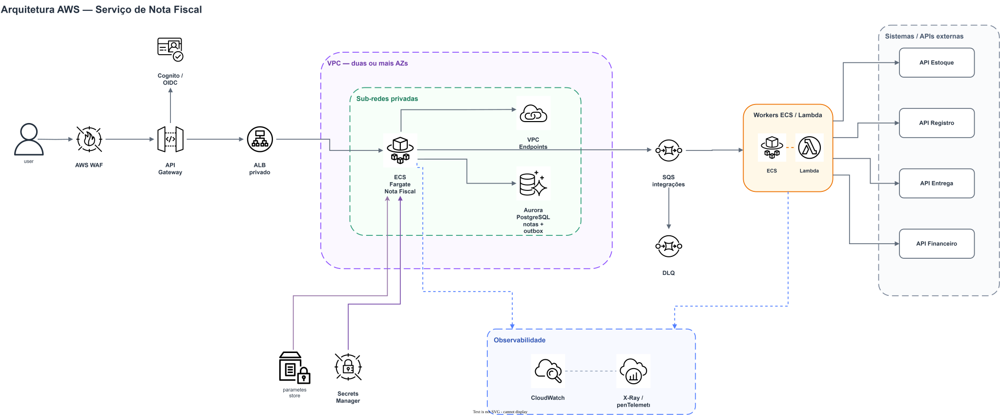

# Arquitetura proposta para produção

## Visão geral

Fonte editável: [diagrama Draw.io](./arquitetura_aws_nota_fiscal_drawio.xml).

## Fluxo produtivo recomendado

1. O API Gateway valida autenticação, limites e payload máximo; o `X-Correlation-ID` entra ou é criado na aplicação.
2. O serviço calcula e persiste nota + eventos de integração na mesma transação (transactional outbox).
3. Um publicador envia eventos idempotentes à SQS. A resposta da nota não aguarda a latência externa.
4. Workers consomem estoque, registro, entrega e financeiro em paralelo, propagando `X-Correlation-ID` e chave de idempotência.
5. Retentativas usam backoff exponencial com jitter; mensagens esgotadas vão para DLQ e geram alerta.

O adapter assíncrono em memória deste repositório representa essa fronteira sem fingir durabilidade. A porta `PublicarIntegracoesNotaFiscalPort` permite trocar o adapter por outbox/SQS sem alterar o caso de uso.

## Escalabilidade, disponibilidade e segurança

- ECS Fargate em pelo menos duas AZs, com autoscaling por latência, CPU e backlog da fila.
- ALB, banco Multi-AZ, backups point-in-time e SQS gerenciada removem pontos únicos de falha.
- Tasks em sub-redes privadas; acesso AWS por VPC endpoints e egress externo controlado.
- IAM por workload com menor privilégio; segredos fora da imagem e rotação pelo Secrets Manager.
- TLS em trânsito e KMS em repouso; WAF, throttling e autenticação OIDC na borda.
- Payloads e documentos não são registrados em logs.

## Resiliência

- timeout por integração menor que o timeout total do consumidor;
- retry somente para falhas transitórias e operações idempotentes;
- circuit breaker para impedir efeito cascata;
- bulkhead/executor separado por integração em escala real;
- DLQ, replay auditável e reconciliação periódica entre nota e sistemas consumidores.

## Observabilidade e SLOs iniciais

- logs estruturados: `correlationId`, `step`, `status`, `durationMs`, integração e ID da nota;
- métricas: erros, p50/p95/p99, fila/idade da mensagem e tamanho da DLQ;
- traces via OpenTelemetry, propagando W3C `traceparent` além do correlation ID de negócio;
- SLO inicial da API: 99,9% de disponibilidade e p95 abaixo de 500 ms, excluindo dependências assíncronas;
- alertas por burn rate, DLQ não vazia e idade máxima da mensagem.

## Deploy e rollback

- pipeline: build reproduzível, testes, análise de dependências/SAST, imagem assinada e scan de container;
- deploy blue/green ou canário no ECS, com smoke test e promoção condicionada a métricas;
- rollback aponta o serviço para a task definition anterior; migrations seguem expand/contract;
- eventos carregam versão de schema para permitir convivência entre versões durante rollout.
